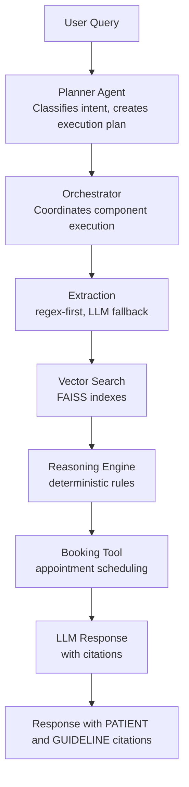
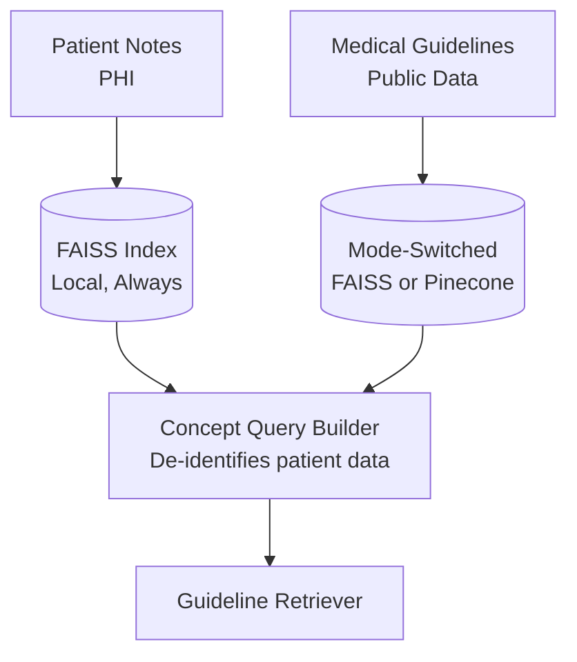
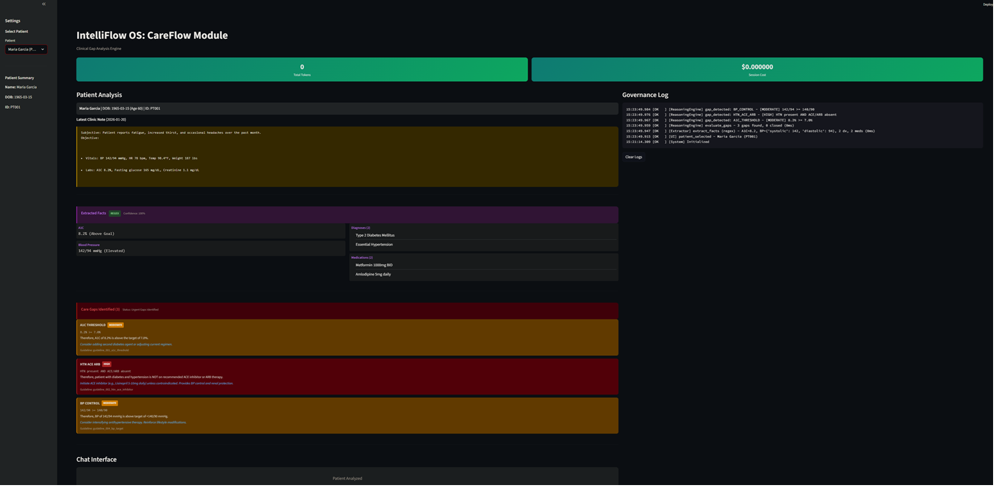
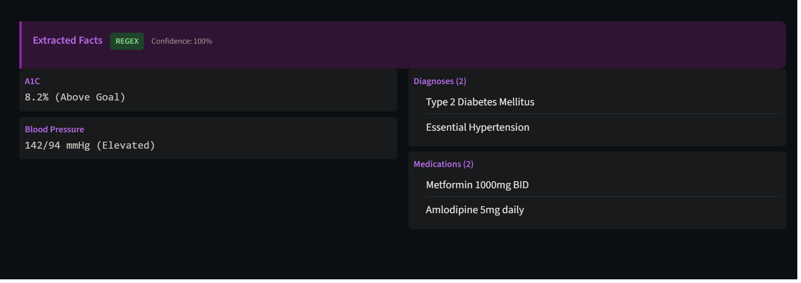
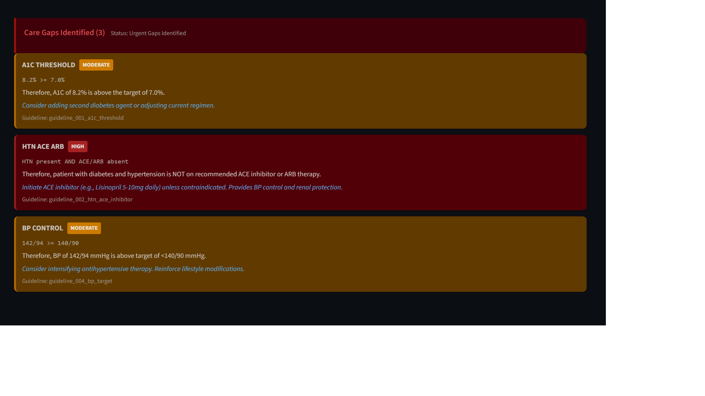
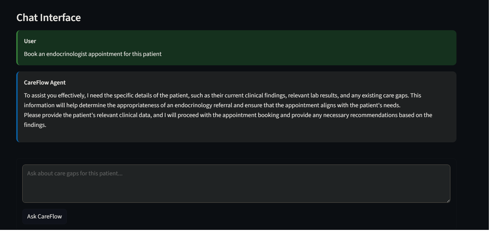
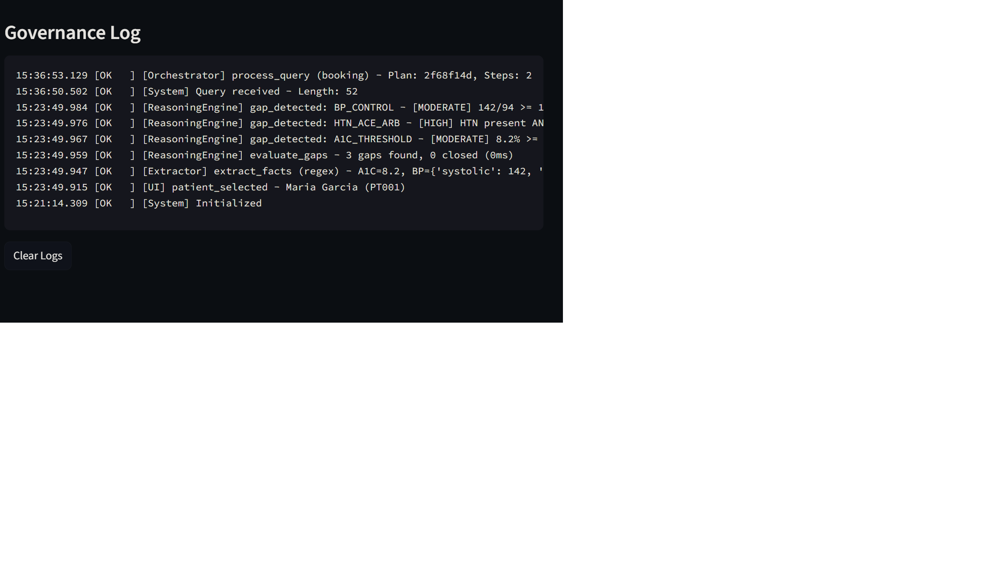

# IntelliFlow OS: CareFlow Module

**Clinical Gap Analysis Engine**

> **DISCLAIMER**: This is a demonstration/prototype application for educational purposes only. It is NOT intended for actual clinical use. Do not use this system to make real medical decisions. Always consult qualified healthcare professionals for medical advice.

---

## Overview

CareFlow is a clinical decision support module that identifies care gaps for diabetic patients using a hybrid AI architecture. The core principle is:

**"LLM extracts, CODE reasons, LLM explains"**

- **LLM extracts**: Uses regex-first extraction with LLM fallback for robustness
- **CODE reasons**: Deterministic rules for gap detection (no LLM in reasoning)
- **LLM explains**: Natural language responses with evidence citations

This architecture ensures:
- **Reproducibility**: Same inputs always produce same gap detection results
- **Auditability**: Every decision can be traced to specific rules and evidence
- **Transparency**: Clear "Therefore" statements explain the reasoning

---

## The "Therefore" Problem

Most LLM healthcare demos fail because they let the model compute clinical logic:

```
BAD: "Patient has diabetes and high A1C, therefore..."
     (LLM guessing at gap logic - may hallucinate)

GOOD:
  - EXTRACT (Regex/LLM): "A1C: 8.2%, Diagnosis: Type 2 DM"
  - RULE (Code): IF a1c >= 7.0 THEN gap_detected = True
  - EXPLAIN (LLM): "Based on ADA guidelines [GUIDELINE: 001], A1C of 8.2% [PATIENT: A1C=8.2%] exceeds target..."
```

CareFlow separates these concerns explicitly.

---

## Architecture



---

## PHI-Aware Data Residency Architecture

CareFlow implements a **PHI-Aware Hybrid Vector Strategy** that demonstrates compliance-informed design for healthcare AI:



### Key Principles

1. **PHI Never Leaves the Machine**: Patient notes are ONLY stored and searched in local FAISS indexes
2. **De-identification Layer**: The ConceptQueryBuilder transforms patient facts into generic clinical concepts before any external query
3. **Mode Switching**: Enterprise deployments can use Pinecone for scalable guideline search while maintaining PHI protection

### Running Modes

```bash
# Local mode (default) - FAISS only, zero external dependencies
python care_app.py --mode=local

# Enterprise mode - Pinecone for guidelines, FAISS for patient data
python care_app.py --mode=enterprise
```

### Concept Query De-identification

```python
# UNSAFE: Direct patient data in query
"Patient PT001 A1C 8.2% diabetes hypertension"

# SAFE: De-identified concept query (what CareFlow sends)
"diabetes glycemic a1c hypertension blood pressure guidelines clinical recommendations"
```

The `ConceptQueryBuilder` extracts only generic clinical concepts:
- Diagnoses → Clinical concepts (never patient names)
- Lab values → Metric categories (never actual numbers)
- Medications → Drug classes (never doses)

### Setting Up Enterprise Mode

1. Set environment variables:
```bash
PINECONE_API_KEY=your_pinecone_api_key
OPENAI_API_KEY=your_openai_api_key
```

2. Ingest guidelines to Pinecone:
```bash
python ingest_guidelines_pinecone.py
```

3. Run in enterprise mode:
```bash
python care_app.py --mode=enterprise
```

---

## Key Design Decisions

### Why Regex-First Extraction?
- **Speed**: Regex is ~100x faster than LLM calls
- **Cost**: Zero API cost for successful regex extraction
- **Determinism**: Same note always extracts to same facts
- **LLM Fallback**: When regex fails, LLM ensures robustness

### Why Deterministic Reasoning?
- **Reproducibility**: A1C of 8.2 will ALWAYS trigger a gap (no hallucination)
- **Auditability**: Rules are explicit and auditable
- **Testing**: Easy to write comprehensive unit tests
- **Trust**: Clinicians can verify the logic

### Why Citations?
- **Evidence-based**: Every claim linked to source
- **Verifiable**: Users can check patient data and guidelines
- **Transparent**: Clear reasoning chain

---

## Features

- **Patient Analysis**: Automatic extraction of A1C, BP, diagnoses, medications
- **Gap Detection**: Rules-based identification of care gaps
  - A1C threshold (>= 7.0%)
  - HTN ACE/ARB therapy (DM + HTN without ACE/ARB)
  - BP control (>= 140/90 mmHg)
- **Appointment Booking**: Schedule specialist follow-ups based on gaps
- **Guideline Search**: FAISS vector search over medical guidelines
- **Governance Logging**: Full audit trail of all operations
- **FHIR Ingestion**: Structured data intake from HL7 FHIR R4 Bundles

---

## Interoperability & Data Standards

CareFlow supports dual-mode data ingestion — structured FHIR resources and unstructured clinical notes — so the same reasoning engine works regardless of how data arrives.

| Standard | Support | Details |
|----------|---------|---------|
| HL7 FHIR R4 | Bundle, Patient, Observation | Parses FHIR JSON bundles to extract demographics and lab results |
| LOINC | A1C keyed to code 4548-4 | Terminology-aware extraction from Observation resources |
| Legacy (unstructured) | Regex-first, LLM fallback | Existing pipeline for free-text clinical notes |

### How It Works

```
FHIR Bundle (JSON)          Unstructured Note (text)
       │                              │
       ▼                              ▼
  fhir_ingest.py              extraction.py
  (parse Bundle →             (regex-first →
   Patient + Observation)      LLM fallback)
       │                              │
       └──────────┬───────────────────┘
                  ▼
         Reasoning Engine
      (deterministic gap rules)
```

Both paths feed the same deterministic reasoning engine — structured data skips the extraction uncertainty entirely.

---

## Tech Stack

| Layer | Technology | Purpose |
|-------|------------|---------|
| LLM | OpenAI GPT-4o-mini | Extraction fallback + Explanation |
| Extraction | Python regex | Primary fact extraction |
| Reasoning | Python code | Deterministic gap logic |
| Vector Store | FAISS (local) | PHI-safe patient note retrieval |
| Vector Store | Pinecone (enterprise) | Scalable guideline retrieval |
| PHI Protection | ConceptQueryBuilder | De-identification layer |
| Embeddings | text-embedding-3-small | Document embeddings |
| Database | SQLite | Patients, appointments, audit logs |
| UI | Streamlit | Demo interface |

---

## Project Structure

```
IntelliFlow_CareFlow/
|-- care_app.py              # Streamlit UI
|-- care_database.py         # SQLite database layer
|-- care_orchestrator.py     # Plan execution coordinator
|-- planner_agent.py         # Query planning and intent classification
|-- extraction.py            # Regex-first fact extraction
|-- fhir_ingest.py           # FHIR R4 Bundle parser (dual-mode ingestion)
|-- reasoning_engine.py      # Deterministic gap detection rules
|-- tools.py                 # Booking tool and utilities
|-- vector_store_faiss.py    # FAISS index management (PHI-safe, local)
|-- concept_query.py         # PHI de-identification layer
|-- guideline_retriever.py   # Hybrid vector retrieval (FAISS/Pinecone)
|-- ingest_guidelines_pinecone.py  # Enterprise mode setup script
|-- seed_care_data.py        # Sample data seeder
|-- test_suite.py            # Test runner
|-- tests/
|   |-- test_extraction.py   # Extraction layer tests
|   |-- test_reasoning.py    # Reasoning engine tests
|   |-- test_booking.py      # Booking tool tests
|   |-- test_concept_query.py  # PHI de-identification tests
|   |-- test_retrieval.py    # Hybrid retrieval tests
|   |-- test_fhir_ingest.py  # FHIR ingestion tests
|-- data/
|   |-- medical_kb/          # Guideline markdown files (10 guidelines)
|   |-- fhir_bundle.json     # Sample FHIR R4 Bundle (Patient + A1C Observation)
|-- indexes/                 # FAISS indexes (gitignored)
```

---

## Installation

1. Clone the repository:
```bash
git clone https://github.com/yourusername/IntelliFlow_CareFlow.git
cd IntelliFlow_CareFlow
```

2. Create virtual environment:
```bash
python -m venv venv
source venv/bin/activate  # On Windows: venv\Scripts\activate
```

3. Install dependencies:
```bash
pip install -r requirements.txt
```

4. Set up environment variables:
```bash
cp .env.example .env
# Edit .env and add your OPENAI_API_KEY
```

5. Run the application:
```bash
streamlit run care_app.py
```

---

## How to Test

Run the full test suite:

```bash
python test_suite.py
```

This will:
- Run all extraction tests (11 tests)
- Run all reasoning tests (14 tests)
- Run all booking tests (11 tests)
- Output detailed results to `test_results.txt`

Run individual test modules:

```bash
# Extraction tests only
python tests/test_extraction.py

# Reasoning tests only
python tests/test_reasoning.py

# Booking tests only
python tests/test_booking.py
```

### Expected Test Results

```
SUMMARY
======================================================================
  [PASS] Extraction: 11/11
  [PASS] Reasoning: 14/14
  [PASS] Booking: 11/11
  [PASS] Concept Query: 15/15
  [PASS] Retrieval: 15/15
  [PASS] FHIR Ingest: 3/3
----------------------------------------------------------------------
  TOTAL: 69/69 (ALL TESTS PASSED)
```

---

## Sample Patients

| ID | Name | A1C | BP | Key Gaps |
|----|------|-----|-----|----------|
| PT001 | Maria Garcia | 8.2% | 142/94 | A1C, ACE/ARB, BP |
| PT002 | James Wilson | 7.4% | 128/82 | A1C (borderline) |
| PT003 | Sarah Chen | 9.1% | 118/76 | High A1C |
| PT004 | Robert Johnson | 6.8% | 148/94 | ACE/ARB, BP |
| PT005 | Linda Martinez | 7.0% | 122/78 | At A1C goal |

---

## Screenshots

### Main UI

*CareFlow main interface with patient selection*

### Extracted Facts

*Regex-first extraction of clinical facts from patient notes*

### Care Gaps

*Deterministic gap detection with "Therefore" statements*

### Booking

*Appointment booking based on detected care gaps*

### Governance Log

*Full audit trail of all system operations*

---

## Care Gap Rules

### A1C Threshold Gap
- **Condition**: A1C >= 7.0%
- **Severity**:
  - High: A1C > 9.0%
  - Moderate: 7.0% <= A1C <= 9.0%
- **Guideline**: guideline_001_a1c_threshold

### HTN ACE/ARB Gap
- **Condition**: Diabetes + Hypertension + No ACE inhibitor or ARB
- **Severity**: Moderate
- **Guideline**: guideline_002_htn_ace_arb

### BP Control Gap
- **Condition**: BP >= 140/90 mmHg for diabetic patient
- **Severity**:
  - High: Systolic > 160 or Diastolic > 100
  - Moderate: Otherwise
- **Guideline**: guideline_004_bp_target

---

## API Usage

### Orchestrator

```python
from care_orchestrator import CareOrchestrator

orchestrator = CareOrchestrator()
result = orchestrator.process_query(
    query="What care gaps does this patient have?",
    patient_id="PT001"
)

print(result.response)  # Natural language response with citations
print(result.reasoning_result.gaps)  # List of detected gaps
```

### Extraction

```python
from extraction import PatientFactExtractor

extractor = PatientFactExtractor()
facts = extractor.extract(note_text)

print(f"A1C: {facts.a1c}")
print(f"BP: {facts.blood_pressure}")
print(f"Method: {facts.extraction_method}")  # "regex" or "llm"
```

### Reasoning

```python
from reasoning_engine import ReasoningEngine

engine = ReasoningEngine()
result = engine.evaluate_patient(facts, patient_id)

for gap in result.gaps:
    if gap.gap_detected:
        print(f"{gap.gap_type}: {gap.therefore}")
```

---

## Environment Variables

| Variable | Description | Required |
|----------|-------------|----------|
| OPENAI_API_KEY | OpenAI API key | Yes |
| PINECONE_API_KEY | Pinecone API key (enterprise mode only) | No |

---

## Part of IntelliFlow OS

| Module | Domain | Key Pattern | Status |
|--------|--------|-------------|--------|
| SupportFlow | Banking | Multi-agent routing + policy citations | Complete |
| CareFlow | Healthcare | Multi-hop reasoning + clinical gap analysis | Complete |

---

## License

MIT License - See LICENSE file for details.

---

## Disclaimer

**THIS SOFTWARE IS PROVIDED FOR EDUCATIONAL AND DEMONSTRATION PURPOSES ONLY.**

- This is NOT a certified medical device
- Do NOT use for actual clinical decision-making
- Do NOT rely on this system for patient care
- Always consult qualified healthcare professionals

The authors and contributors are not responsible for any decisions made based on this software.

---

## Contributing

1. Fork the repository
2. Create a feature branch
3. Run tests: `python test_suite.py`
4. Submit a pull request

---

## Acknowledgments

- Medical guidelines are simplified versions for demonstration
- Sample patient data is entirely fictional
- Built as part of the IntelliFlow OS project
